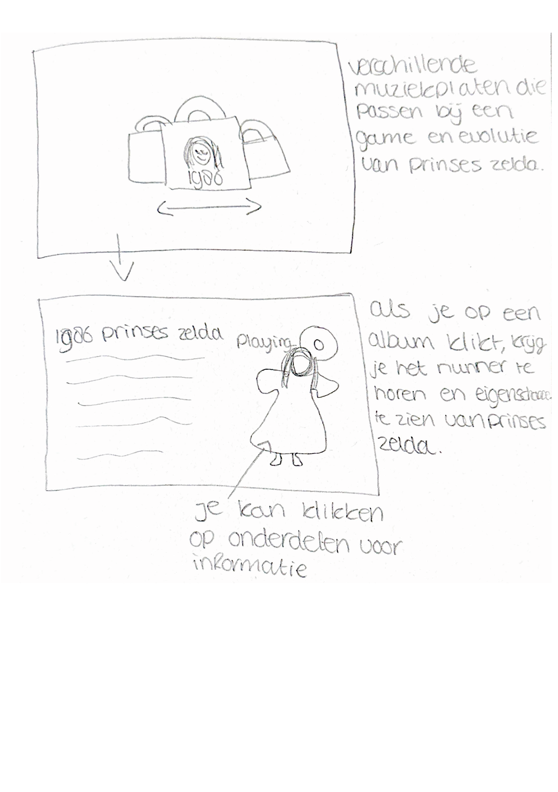
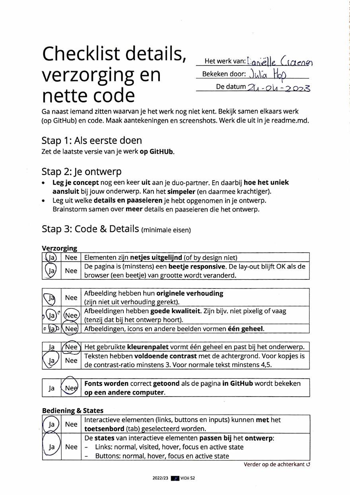
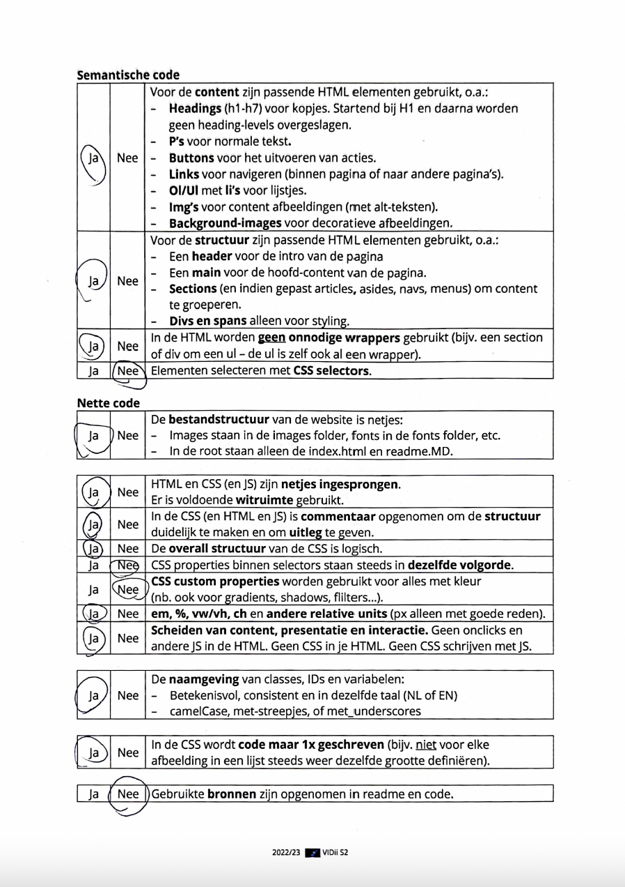
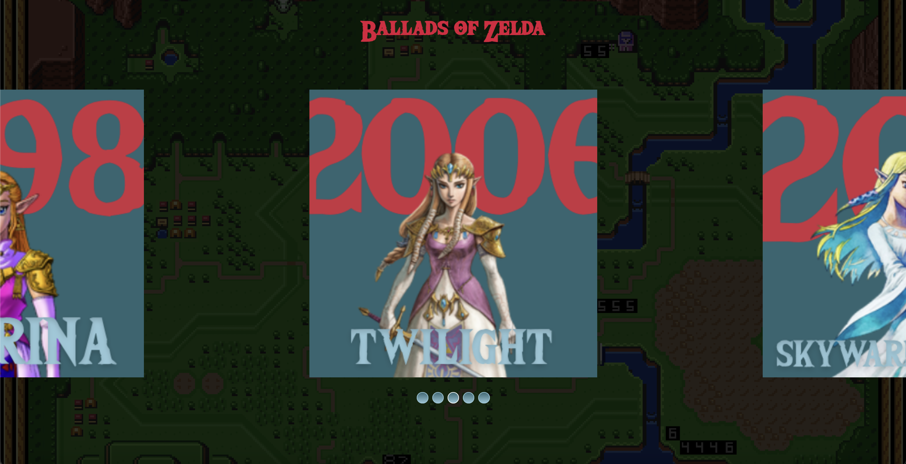
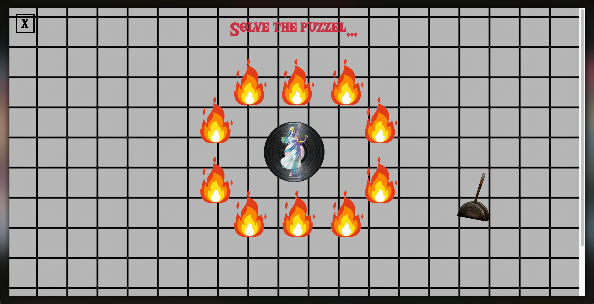
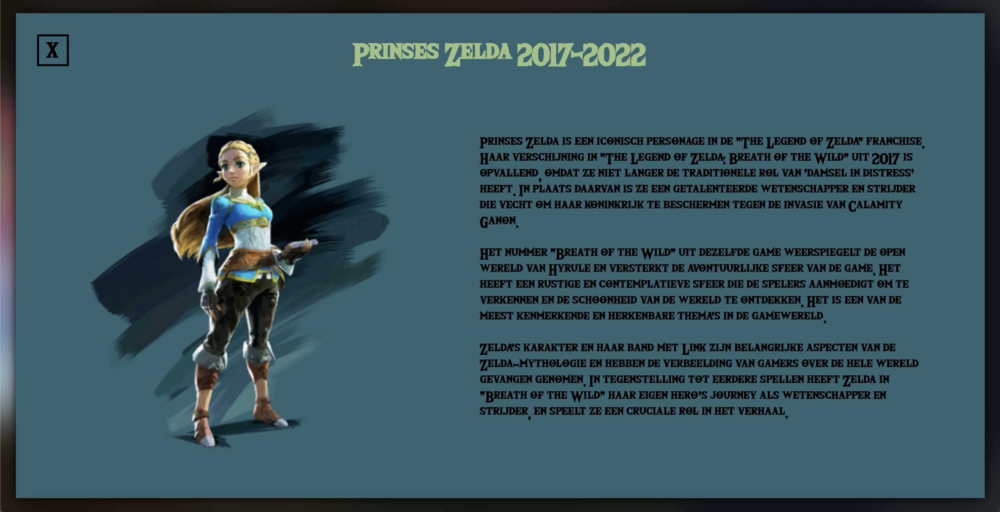
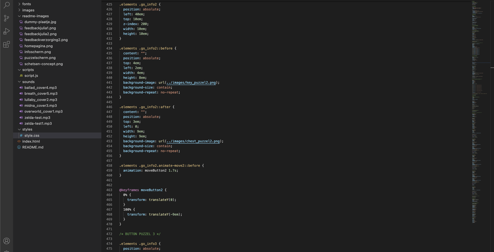
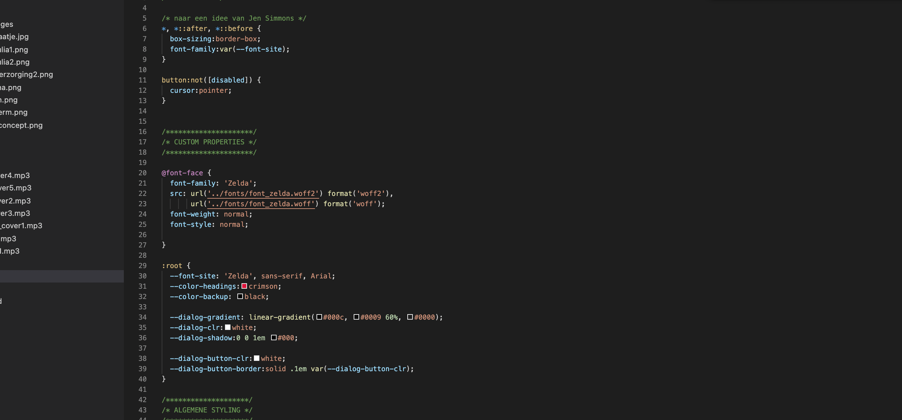
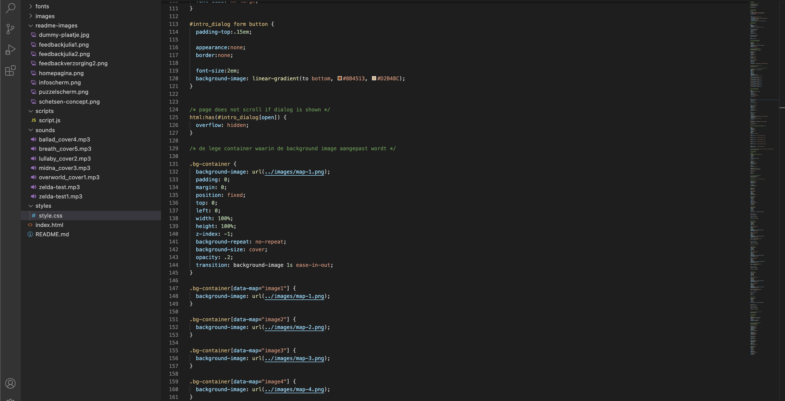
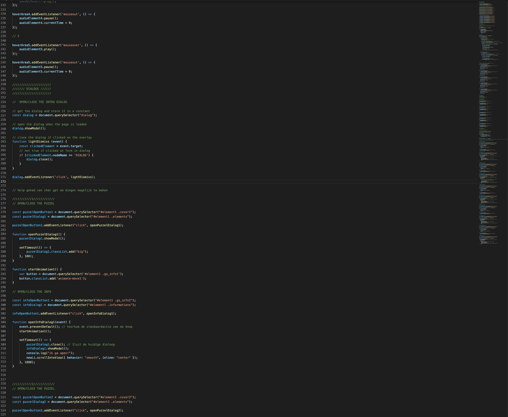

# Procesverslag
Markdown is een simpele manier om HTML te schrijven.  
Markdown cheat cheet: [Hulp bij het schrijven van Markdown](https://github.com/adam-p/markdown-here/wiki/Markdown-Cheatsheet).

Nb. De standaardstructuur en de spartaanse opmaak van de README.md zijn helemaal prima. Het gaat om de inhoud van je procesverslag. Besteedt de tijd voor pracht en praal aan je website.

Nb. Door *open* toe te voegen aan een *details* element kun je deze standaard open zetten. Fijn om dat steeds voor de relevante stuk(ken) te doen.

## Jij

### Ontwerper:
Daniëlle Craenen

#### Je startniveau:
Mijn startniveau is: BLAUW

# Je plan

  
De eerste versie/schets van je ontwerp & je persoonlijke uitdaging

  ### De eerste versie/schets:
  
Mijn ontwerp concept zal gericht zijn op de evolutie van prinses Zelda uit Legends of Zelda. Ik heb onderzoek gedaan naar de game en de evolutie. Ik vind hierbij de evolutie die prinses, of nu Sheikah Zelda heeft doorgemaakt het meest interessant.

Je ziet dat prinses Zelda uit het typische storytelling is ontstaan zoals die vroeger vaak werd verteld. Een prinses die gered moet worden, een slechterik en een superheld/prins die de prinses komt redden. Dit is dan ook de rode draad van Legends of Zelda. Door de jaren heen is dit steeds meer veranderd naar een stoere strijder die veel meer is dan een prinses die gered moet worden. Zo zie je dat dit met de behoeftes van die periodes zo is gaan vormen.

Mijn concept is een interactieve "muzikale reis" waarin de kijker een muzikaal pad volgt dat de evolutie van Princess Zelda vertegenwoordigt. De kijker kan verschillende muziekstukken of liedjes selecteren die kenmerkend zijn voor de verschillende games waarin Princess Zelda voorkomt, en deze afspelen om de sfeer en de muzikale stijl van elke game te ervaren.
Ik heb gekozen om dit concept uit te werken aangezien Legends of Zelda bekend staat om zijn karakteristieke muziekstukken. Ik kan samen met de link aan deze liedjes gelijk prinses Zelda haar evolutie vertellen over de jaren heen.

Ik zou graag de unieke puzzels uit zelda hierin willen verwerken zodra je een album wilt openen. Zo moet je eerst deze puzzel volbrengen voordat je de informatie kan lezen!

  ### Je ambitie: 
  Aan deze technieken/punten wil ik werken:
  - Ik wil mijn CSS weer bijspijkeren
  - Ik wil leren animeren in CSS
  - Ik wil sounds leren coderen
  - Eventueel een beetje javascript leren

Ik heb al wat mogen coderen, maar toch blijf ik dit erg lastig vinden. Daarom is het voor mij een doel om beter CSS te leren begrijpen en dit toe te kunnen passen. Daarbij wil ik graag animaties in CSS leren. Ik vind zelf persoonlijk dat dit je website er echt professioneel uit kan laten zien wat ik goed kan gebruiken ook in de toekomst. Daarbij wil ik leren werken met media queries aangezien deze goed bij mijn onderwerp passen van mijn concept. Als er daarna nog tijd over is is het misschien leuk om paar regeltjes javascript te leren!

## Voortgang/Feedback 1

  
Mijn bevindingen + wijzigingen

  ### Bevinding 1:
  Tatum: Je zou eventueel concept 1 en concept 2 combineren, maar ik zou sws voor concept 2 gaan want ik vind het idee met de nummers op de achtergrond heel erg leuk!

  #### oplossing:
  Ik zal toelichten dat je op prinses Zelda haar kleding kan klikken voor informatie!

  ### Bevinding 2:
  Sam: Ik zou kijken om het nog iets persoonlijker te maken voor de games. Die puzzels zijn al een goede start!

  #### oplossing:
  Ik wil per platen album de achtergrondafbeelding aanpassen. Dit kan de map worden van de game of het zelda instrument die in het nummer speelt.
  Daarnaast zal ik de Zelda-thema kleuren gebruiken om dit nog persoonlijker te maken.

  ### Bevinding 3:
  Sam: ik zou de meest belangrijkste evoluties kiezen. Anders maak je je het jezelf lastiger dan nodig hoeft te zijn.

  #### oplossing:
  Ik zal de beste evoluties en bijpassende liedjes uitkiezen!

## Voortgang/Feedback 2

  
Mijn bevindingen + wijzigingen

  
  
  
  ### Bevinding 1:
   
  Op moment van het feedback had ik mij nog niet bezig gehouden met het mooi maken van de website. Het was puur functionaliteit. Ik had daarom hier niet een goede beoordeling van. Wat ik ook begrijp!

  #### oplossing:
  Ik ben bezig geweest met de huisstijl van Legend of Zelda en heb hier een kleurenpalet op uitgekozen. Ik heb ook alle album covers, puzzels en info pagina's consistent gemaakt op zelda en het kleurenpalet!

  ### Bevinding 2:
  Ik had nog de basis font verwerkt in mijn website. Deze is niet gebasseerd op mijn gekozen thema.

  #### oplossing:
  Ik heb gekeken naar de font die Legend of Zelda gebruikt en een vergelijkbare uitgekozen. Ik heb niet dezelfde font aangezien deze betaald was.

  ### Bevinding 3:
  Op het moment van het feedback had ik nog geen custom properties. Ik had daarom de feedback gekregen om hier naar te kijken!

  #### oplossing:
  Ik heb custom properties toegepast in mijn code waarvan ik dacht dat het goed van pas kon zijn!

## Voortgang/Feedback 3

  
Mijn bevindingen + wijzigingen

  ### Isabelle haar feedback op mijn eind versie:
  Ontzettend origineel idee en ook heel origineel uitgewerkt. Je hebt je tijdlijn super interactief gemaakt. Je kan swipen, op van alles klikken en je hebt zelfs een puzzel toegevoegd. De look en feel past ook goed bij je onderwerp. Je code is duidelijk en je kan zien dat je er veel moeite in hebt gestopt. Het enige wat ik kan bedenken is dat je misschien extra comments kan toevoegen voor jezelf, ookal doe je dit al goed! Ik heb er verder echt niks op aan te merken. Heel goed bezig!
  
  ### Bevinding 1:
  Ik heb als feedback gekregen dat ik nog extra kan kijken naar comments die het voor mij nog duidelijker kunnen maken.

  #### oplossing:
  Ik heb comments toegevoegd op plekken van code die ik nog lastig vind.

## Reflectie

  
Mijn eindresultaat & persoonlijke ontwikkeling

  ### Je uitkomst - karakteristiek screenshot(s):
  
  
  

  Wat ik leuk vind om terug te zien in deze read me is hoe ik van een concept in mijn schetsboek, nu ben gekomen op een werkende website!
  Voor mij is coderen zeker een uitdaging en heb ik altijd erg lastig gevonden. Toch zie ik dat ik in deze korte periode enorm gegroeid ben! Ik heb zo ook al mijn ambities aangetikt! Ik heb zeker mijn CSS bijgespijkerd, zelfs heel veel meer geleerd dan dat. Het animeren in CSS is mij ook goed afgegaan. Ik heb bij iedere puzzel gebruik kunnen maken van keyframes. Wat is het leuk om te zien hoe dat tot leven komt! Al was het zeker niet zonder slag of stoot...het is me gelukt!
  Ik heb ook veel gebruik gemaakt van sounds in mijn website. Zo is natuurlijk mijn hele concept daarop gebasseerd! Een mooi en leuk iets om te zien hoe erg tot leven mijn website daarvan kwam! En natuurlijk nogsteeds levendig!
  Waar ik denk ik het meest trots op ben is het feit dat ik javascript heb leren schrijven. Ik heb daar wel erg veel hulp bij gekregen... toch begin ik het wel te begrijpen in de grote lijnen! Dat had ik paar weken geleden nooit verwacht.
  Ik kan daarom wel zeggen voor mij dat dit een geslaagd project is!

  ### Dit ging goed/Heb ik geleerd: 
  Het ging mij goed af om steeds meer CSS te leren. Zo heb ik leren werken met 
  - pseudomeinen
  - indexen
  - custom properties
  - keyframes
  - containers
  - en nog veel meer!

  
  
  

  ### Dit was lastig/Is niet gelukt:
  Wat voor mij lastig was, was javascript. Dit had ik ook wel verwacht aangezien dit de eerste keer is dat ik met javascript heb gecodeerd. Ik heb daarom hierbij heel veel hulp gekregen. Ik kan deze code ook niet op mezelf schrijven.

  Daardoor was het ook gekomen dat mijn code uiteindelijk kapot was gegaan doordat er teveel in werd geprobeerd waarvan ik zelf niet begreep wat er gedaan werd. Dit was even lastig en frustrerend. Gelukkig ben ik hier uiteindelijk uit geholpen en kon ik toen door!

  Toch ben ik wel blij dat ik hier en daar al wat begin te begrijpen!

  

## Bronnenlijst

continu bijhouden terwijl je werkt

Nb. Wees specifiek ('css-tricks' als bron is bijv. niet specifiek genoeg).

1. https://css-tricks.com/snippets/css/a-guide-to-flexbox/
2. https://codepen.io/shooft/pen/abmLPwy
3. https://nl.wikipedia.org/wiki/Langspeelplaat (voor afbeelding)
4. https://github.com/Jobbie20/VIDii (voor inspiratie)
5. https://codepen.io/shooft/pen/LYgxoMO
6. https://codepen.io/shooft/pen/jOeyxev
7. https://codepen.io/shooft/pen/PoyWMWb
8. https://fontmeme.com/fonts/the-wild-breath-of-zelda-font/#previewtool
9. https://www.istockphoto.com/nl/foto/stone-wall-gm521079280-91225453 (afbeelding)
10. https://www.deviantart.com/jzkart/art/3D-Game-Prop-Lever-598734165 (afbeelding)
11. https://zelda.fandom.com/wiki/Treasure_Chest (afbeelding)
12. https://www.ign.com/wikis/the-legend-of-zelda-skyward-sword/Zelda (afbeelding)
13. https://zelda.fandom.com/wiki/Princess_Zelda (afbeeldingen)
14. https://en.wikipedia.org/wiki/Princess_Zelda (afbeelding)
15. https://www.youtube.com/watch?v=ncg72VswyTs (muziek)
16. https://www.youtube.com/watch?v=YHO6EDIbGlk (muziek)
17. https://www.youtube.com/watch?v=137YvPWp0jI (muziek)
18. https://www.youtube.com/watch?v=v4ReyoNpyrM (muziek)
19. https://www.youtube.com/watch?v=cPWBG6_jn4Y (muziek)
20. https://scribblenauts.fandom.com/wiki/Wooden_Cage (afbeelding)
21. https://www.pngwing.com/en/free-png-knclo (afbeelding)
22. https://zelda.fandom.com/wiki/Shadow_Beast (afbeelding)
23. https://www.istockphoto.com/nl/foto/sand-background-gm519045458-90345889?phrase=zand (afbeelding)
24. https://www.istockphoto.com/nl/vector/vuur-vlam-icoon-ge%C3%AFsoleerde-vuurteken-emoticon-vlam-symbool-ge%C3%AFsoleerd-op-wit-vuur-gm1137962021-303628328 (afbeelding)
25. gratis afbeelding en veel chat gpt ter ondersteuning :)

