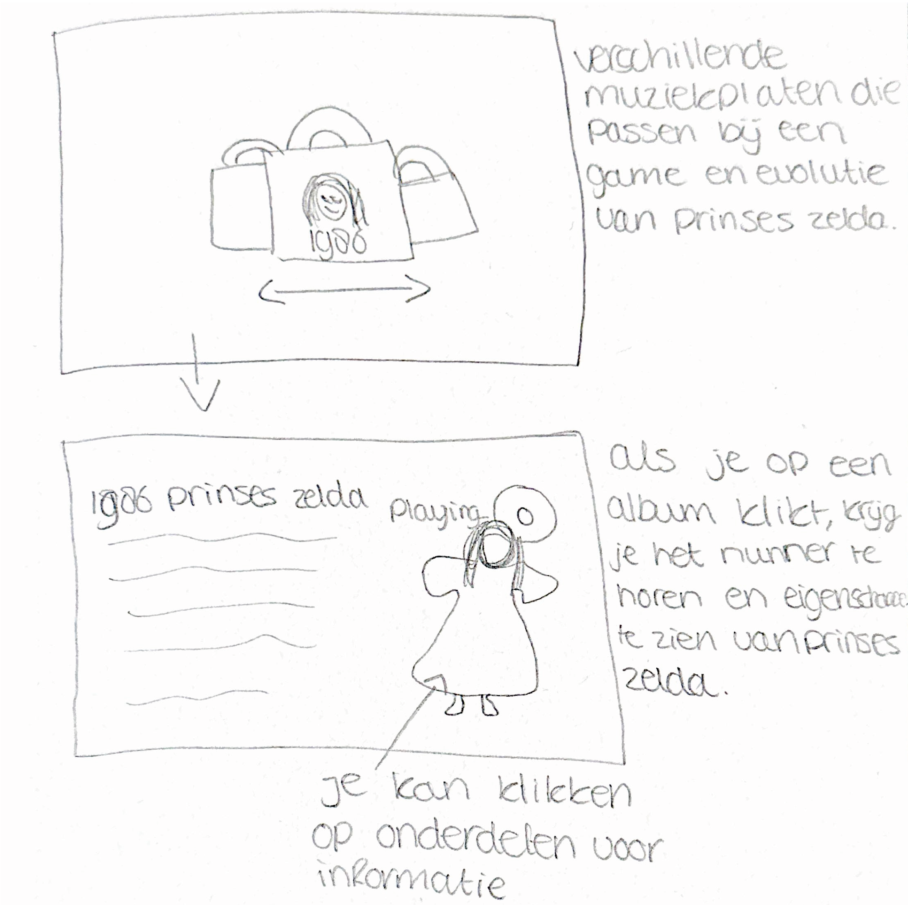

# Procesverslag
Markdown is een simpele manier om HTML te schrijven.  
Markdown cheat cheet: [Hulp bij het schrijven van Markdown](https://github.com/adam-p/markdown-here/wiki/Markdown-Cheatsheet).

Nb. De standaardstructuur en de spartaanse opmaak van de README.md zijn helemaal prima. Het gaat om de inhoud van je procesverslag. Besteedt de tijd voor pracht en praal aan je website.

Nb. Door *open* toe te voegen aan een *details* element kun je deze standaard open zetten. Fijn om dat steeds voor de relevante stuk(ken) te doen.

## Jij

### Ontwerper:
Daniëlle Craenen

#### Je startniveau:
Mijn startniveau is: BLAUW

# Je plan

  
De eerste versie/schets van je ontwerp & je persoonlijke uitdaging

  ### De eerste versie/schets:
  
Mijn ontwerp concept zal gericht zijn op de evolutie van prinses Zelda uit Legends of Zelda. Ik heb onderzoek gedaan naar de game en de evolutie. Ik vind hierbij de evolutie die prinses, of nu Sheikah Zelda heeft doorgemaakt het meest interessant.

Je ziet dat prinses Zelda uit het typische storytelling is ontstaan zoals die vroeger vaak werd verteld. Een prinses die gered moet worden, een slechterik en een superheld/prins die de prinses komt redden. Dit is dan ook de rode draad van Legends of Zelda. Door de jaren heen is dit steeds meer veranderd naar een stoere strijder die veel meer is dan een prinses die gered moet worden. Zo zie je dat dit met de behoeftes van die periodes zo is gaan vormen.

Mijn concept is een interactieve "muzikale reis" waarin de kijker een muzikaal pad volgt dat de evolutie van Princess Zelda vertegenwoordigt. De kijker kan verschillende muziekstukken of liedjes selecteren die kenmerkend zijn voor de verschillende games waarin Princess Zelda voorkomt, en deze afspelen om de sfeer en de muzikale stijl van elke game te ervaren.
Ik heb gekozen om dit concept uit te werken aangezien Legends of Zelda bekend staat om zijn karakteristieke muziekstukken. Ik kan samen met de link aan deze liedjes gelijk prinses Zelda haar evolutie vertellen over de jaren heen.

Ik zou graag de unieke puzzels uit zelda hierin willen verwerken zodra je een album wilt openen. Zo moet je eerst deze puzzel volbrengen voordat je de informatie kan lezen!

  ### Je ambitie: 
  Aan deze technieken/punten wil ik werken:
  - Ik wil mijn CSS weer bijspijkeren
  - Ik wil leren animeren in CSS
  - Ik wil sounds leren coderen
  - Eventueel een beetje javascript leren

Ik heb al wat mogen coderen, maar toch blijf ik dit erg lastig vinden. Daarom is het voor mij een doel om beter CSS te leren begrijpen en dit toe te kunnen passen. Daarbij wil ik graag animaties in CSS leren. Ik vind zelf persoonlijk dat dit je website er echt professioneel uit kan laten zien wat ik goed kan gebruiken ook in de toekomst. Daarbij wil ik leren werken met media queries aangezien deze goed bij mijn onderwerp passen van mijn concept. Als er daarna nog tijd over is is het misschien leuk om paar regeltjes javascript te leren!

## Voortgang/Feedback 1

  
Mijn bevindingen + wijzigingen (minimaal 5)

  ### Bevinding 1:
  Tatum: Je zou eventueel concept 1 en concept 2 combineren, maar ik zou sws voor concept 2 gaan want ik vind het idee met de nummers op de achtergrond heel erg leuk!

  #### oplossing:
  Ik zal toelichten dat je op prinses Zelda haar kleding kan klikken voor informatie!

  ### Bevinding 2:
  Sam: Ik zou kijken om het nog iets persoonlijker te maken voor de games. Die puzzels zijn al een goede start!

  #### oplossing:
  Ik wil per platen album de achtergrondafbeelding aanpassen. Dit kan de map worden van de game of het zelda instrument die in het nummer speelt.
  Daarnaast zal ik de Zelda-thema kleuren gebruiken om dit nog persoonlijker te maken.

  ### Bevinding 3:
  Sam: ik zou de meest belangrijkste evoluties kiezen. Anders maak je je het jezelf lastiger dan nodig hoeft te zijn.

  #### oplossing:
  Ik zal de beste evoluties en bijpassende liedjes uitkiezen!

## Voortgang/Feedback 2

  
Mijn bevindingen + wijzigingen (minimaal 5)

  
  ### Bevinding 1:
  Omschrijving van wat er nog niet orde was (tekst en afbeeding(en)).

  #### oplossing:
  Beschrijving hoe je het hebt hebt opgelost of als het niet gelukt is hoe je het zou oplossen (tekst en afbeeding(en)).

  ### Bevinding 2:
  Omschrijving van wat er nog niet orde was (tekst en afbeeding(en)).

  #### oplossing:
  Beschrijving hoe je het hebt hebt opgelost of als het niet gelukt is hoe je het zou oplossen (tekst en afbeeding(en)).

  ### Bevinding 3:
  ...

## Voortgang/Feedback 3

  
Mijn bevindingen + wijzigingen (minimaal 5)

  
  ### Bevinding 1:
  Omschrijving van wat er nog niet orde was (tekst en afbeeding(en)).

  #### oplossing:
  Beschrijving hoe je het hebt hebt opgelost of als het niet gelukt is hoe je het zou oplossen (tekst en afbeeding(en)).

  ### Bevinding 2:
  Omschrijving van wat er nog niet orde was (tekst en afbeeding(en)).

  #### oplossing:
  Beschrijving hoe je het hebt hebt opgelost of als het niet gelukt is hoe je het zou oplossen (tekst en afbeeding(en)).

  ### Bevinding 3:
  ...

## Reflectie

  
Mijn eindresultaat & persoonlijke ontwikkeling

  ### Je uitkomst - karakteristiek screenshot(s):
  

  ### Dit ging goed/Heb ik geleerd: 
  Korte omschrijving met plaatje(s)

  

  ### Dit was lastig/Is niet gelukt:
  Korte omschrijving met plaatje(s)

  

## Bronnenlijst

continu bijhouden terwijl je werkt

Nb. Wees specifiek ('css-tricks' als bron is bijv. niet specifiek genoeg).

1. bron 1
2. bron 2
3. ...

